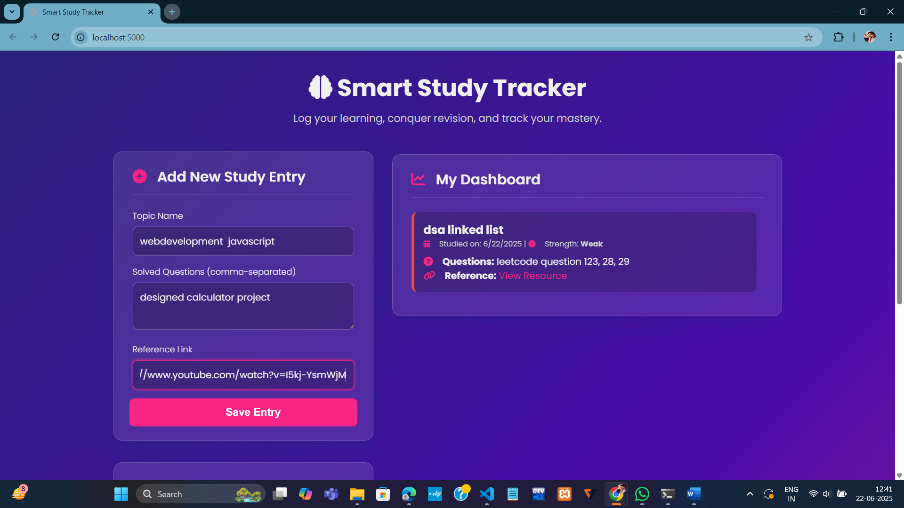
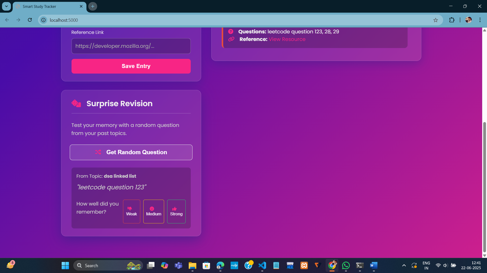

# 📘 Smart Study Tracker

A MERN stack web app that helps students **log their daily study topics**, **upload previously solved questions**, and get **reminders to revise**.

---

## 🚀 Features

- ✏️ Add studied topics with question lists
- 📌 Store reference links
- 🧠 Tracks memory strength (Weak / Medium / Strong)
- 🎯 "Surprise Revision" feature – gives random questions from previously studied topics to check memory
- 📊 Revision dates & memory tracking without AI
- 🔐 Administered with MongoDB Atlas

---

## 💻 Tech Stack

- **Frontend**: HTML, CSS, JavaScript
- **Backend**: Node.js + Express
- **Database**: MongoDB Atlas + Mongoose
- **Others**: CORS, dotenv

---

## 🌱 Project Structure

## 🖼️ Screenshots

### Dashboard

### Upload Solved Questions

### Revision Reminder

